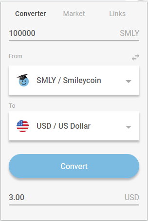
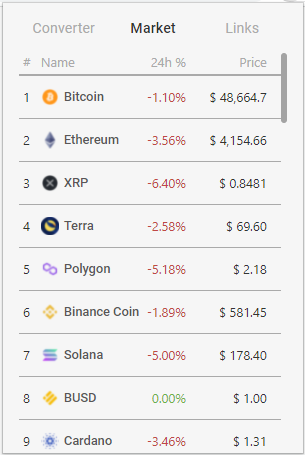
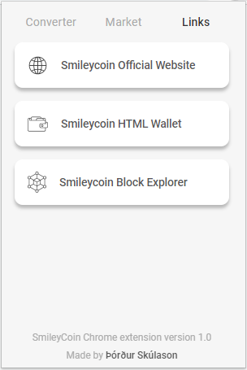

# SmileyCoin Chrome Extension

Download the extension here: (coming soon)

The official Chrome extension for the cryptocurrency [Smileycoin](https://smileyco.in/#/) (SMLY). 

The extension includes:
- Cryptocurrency converter
- Today's top cryptocurrencies prices by market cap
- Shortcut to Smileycoin's official website, the Smileycoin HTML wallet and a blockchain explorer

## Screenshots

  
   
  

## About

This extension was made as a final project for a cryptocurrency course at the University of Iceland.

Made by:

Þórður Skúlason (ths261@hi.is)